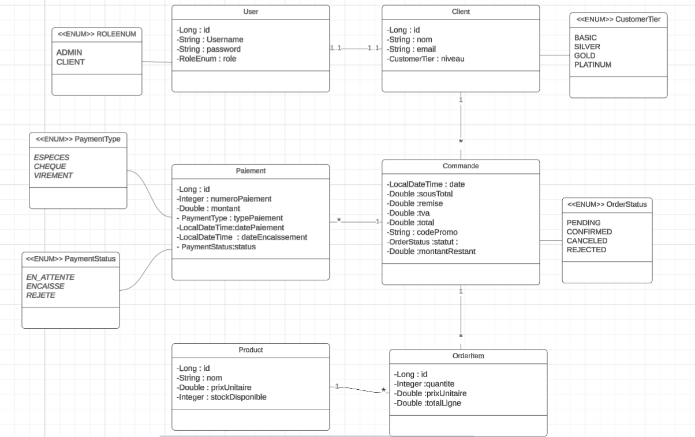

# 🛒 SmartShop – Gestion commerciale B2B

SmartShop est une application web complète développée en **Spring Boot**, destinée à la gestion commerciale d’un distributeur B2B.  
Elle gère les **clients**, **produits**, **commandes**, **paiements**, la **fidélité**, ainsi que les rôles **Admin / Client** avec un système d’authentification basé sur **session**.

---

## 📌 Aperçu du projet



---

## 🎯 Fonctionnalités principales

### 👨‍💼 Espace Administrateur
- Gestion complète des **produits** (CRUD)
- Gestion des **clients** (CRUD)
- Gestion des **commandes** (création, confirmation, annulation)
- Gestion des **paiements** avec *Strategy Pattern* :
    - Espèces
    - Chèque
    - Virement bancaire
- Gestion des **codes promo**
- Consultation de **statistiques globales**

---

### 🧑‍💻 Espace Client
- Consultation de **son profil & niveau de fidélité**
- Historique de **ses propres commandes**
- Historique de **ses paiements**
- Statistiques personnelles :
    - nombre total de commandes
    - montant cumulé
- Accès en lecture seule à la **liste des produits**
- ❌ Aucune modification possible
- ❌ Ne peut pas voir les données des autres clients

---

## 🔒 Sécurité & Authentification

L’application utilise :

- **Login + Session** (pas de JWT)
- Un **AuthFilter personnalisée** vérifiant :
    - `/auth/**` → accès public
    - `/api/admin/**` → réservé rôle **ADMIN**
    - `/api/client/**` → réservé rôle **CLIENT**
    - `/api/**` → interdit si non autorisé
- En cas d’accès non autorisé → réponse JSON via `sendError()`

---

## 🧩 Architecture Technique

## 🏗️ Structure du projet `src/main/java/com/SmartShop/SmartShop`

- **controller/** → REST Controllers
    - Gestion des endpoints pour :
        - Clients
        - Commandes
        - Paiements
        - Produits
        - Codes promo

- **service/** → Business logic
    - **strategy/** → Paiement Strategy Pattern
        - `CashPaymentStrategy` : règles pour paiement en espèces
        - `CheckPaymentStrategy` : règles pour paiement par chèque
        - `BankTransferPaymentStrategy` : règles pour virement bancaire
    - **impl/** → Implémentations des services métier (ClientService, CommandeService, ProductService, PaymentService, PromoCodeService, etc.)

- **entity/** → Entités JPA
    - `Client`, `User`, `Product`, `Commande`, `Paiement`, `PromoCode`, `OrderItem`

- **repository/** → Spring Data Repositories
    - `ClientRepository`, `UserRepository`, `ProductRepository`, `CommandeRepository`, `PaiementRepository`, `PromoCodeRepository`

- **filter/** → AuthFilter (sécurité)
    - Filtrage des requêtes HTTP selon le rôle :
        - `/auth/**` → accès public
        - `/api/admin/**` → réservé au rôle **ADMIN**
        - `/api/client/**` → réservé au rôle **CLIENT**
        - Autres endpoints → interdit si non autorisé
    - Réponse JSON standardisée via `sendError()`

- **exception/** → Gestion des exceptions
    - `ResourceNotFoundException` : ressource introuvable
    - `UnauthorizedException` : accès non authentifié
    - `ForbiddenException` : accès interdit
    - `ApiError` : format uniforme pour les erreurs

- **dto/** → Objets de transfert
    - `ClientDTO`, `ProductDTO`, `CommandeDTO`, `PaiementDTO`, `PromoCodeDTO`


---

## 💳 Paiements – Strategy Pattern

Chaque type de paiement applique ses propres règles via une stratégie dédiée :

### ✔ Espèces (`CashPaymentStrategy`)
- Vérification du **plafond légal de 20 000 MAD**
- Pas d’informations bancaires requises

### ✔ Chèque (`CheckPaymentStrategy`)
Oblige à fournir :
- le nom de la banque
- la référence du chèque
- la date de paiement
- montant non négatif
- statut initial : **EN_ATTENTE**

### ✔ Virement bancaire (`BankTransferPaymentStrategy`)
Valide :
- la banque du virement
- la référence du transfert
- la date de paiement
- statut initial : **EN_ATTENTE**

---

## 🔧 Technologies utilisées

| Technologie | Version |
|------------|---------|
| **Java** | 17 |
| **Spring Boot** | 3.x |
| **Spring Data JPA** | ✔ |
| **Spring Validation** | ✔ |
| **Lombok** | ✔ |
| **H2/MySQL** | selon configuration |
| **Maven** | ✔ |

---

## 📘 Jira du projet

Toutes les user stories et tâches sont disponibles dans Jira :  
👉 https://echchablihamza1-1758101303053.atlassian.net/jira/software/projects/SHOP/list?jql=project%20%3D%20%22SHOP%22%20ORDER%20BY%20created%20DESC

---

## 🚀 Lancer le projet

### 1️⃣ Cloner le dépôt
```bash
git clone https://github.com/<username>/SmartShop.git
cd SmartShop
```


### 2️⃣ configurer Application.properties

```bash
spring.datasource.url=jdbc:mysql://localhost:3306/smartshop
spring.datasource.username=root
spring.datasource.password=
spring.jpa.hibernate.ddl-auto=update
```
### 3️⃣  run the project

```bash
mvn spring-boot:run
```bash